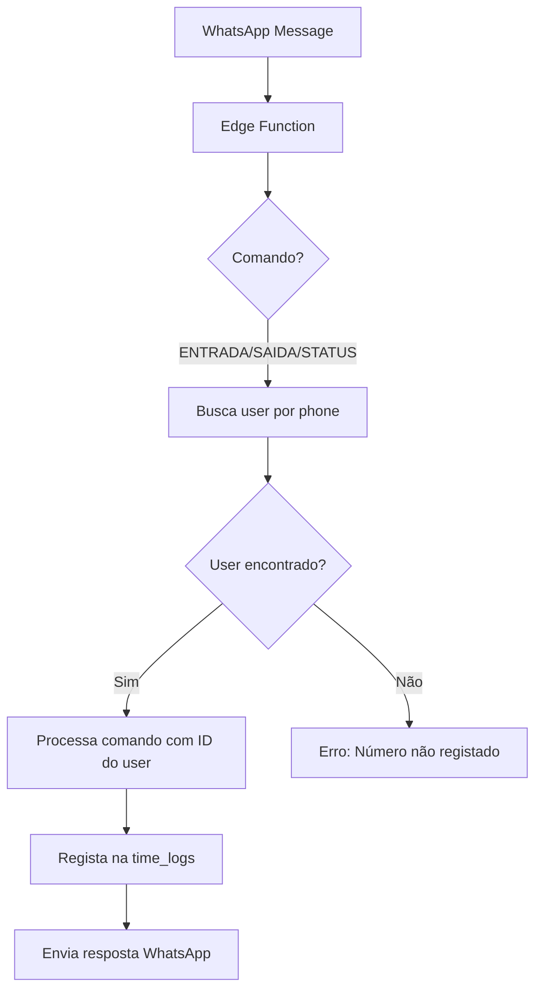

# 🔒 WhatsApp Clock - Sistema Seguro

## ✅ O que foi implementado

### 🛡️ Segurança por Número de Telefone

O sistema agora **identifica automaticamente** cada colaborador pelo número WhatsApp:

1. **Comandos simplificados** - Sem necessidade de ID:
   - `ENTRADA` - Regista a SUA entrada
   - `SAIDA` - Regista a SUA saída
   - `STATUS` - Vê o SEU estado
   - `AJUDA` - Lista comandos

2. **Validação automática**:
   - O sistema busca o utilizador pelo número de telefone
   - Cada pessoa só pode fazer picagem com o seu próprio número
   - Impossível fazer picagem por outro colaborador

3. **Proteção contra comandos antigos**:
   - Se alguém tentar `ENTRADA 73`, o sistema verifica se o número corresponde
   - Se não corresponder, **bloqueia o acesso**

## 📋 Como fazer Deploy

### No Supabase Dashboard:

1. Aceda a **Edge Functions** > `whatsapp-webhook`
2. **Substitua o código** com o conteúdo de:
   ```
   supabase/functions/whatsapp-webhook/index.ts
   ```
3. **IMPORTANTE**: Mantenha **"Verify JWT" DESATIVADO**
4. Clique em **Deploy**

## 🧪 Teste o Sistema Seguro

### Teste 1: Comandos Simples (Recomendado)
Envie para o WhatsApp:
```
ENTRADA
```
Resposta esperada: "✅ Tiago Jorge da Silva Pacheco - Entrada registada às HH:MM"

### Teste 2: Verificar Estado
```
STATUS
```
Resposta esperada: "📊 Tiago Jorge da Silva Pacheco - 🟢 Presente desde HH:MM"

### Teste 3: Registar Saída
```
SAIDA
```
Resposta esperada: "✅ Tiago Jorge da Silva Pacheco - Saída registada às HH:MM - Tempo: Xh"

### Teste 4: Segurança (Tentar outro ID)
```
ENTRADA 69
```
Se o número não corresponder ao ID 69:
Resposta: "🔒 Acesso negado - Por segurança, só pode fazer picagem com o seu próprio ID"

## 📱 Configuração de Novos Utilizadores

Para adicionar um novo utilizador ao WhatsApp Clock:

1. **Na tabela `users`**, adicione o número no campo `phone`:
   ```sql
   UPDATE users
   SET phone = '+351912345678',
       whatsapp_enabled = true
   WHERE id = 123;
   ```

2. O utilizador pode agora usar os comandos simples:
   - ENTRADA
   - SAIDA
   - STATUS

## 🔍 Como o Sistema Funciona



## 🚀 Vantagens do Sistema

1. **Segurança Total** - Impossível fazer picagem por outro
2. **Simplicidade** - Comandos sem ID
3. **Rastreabilidade** - Cada ação ligada ao número
4. **Privacidade** - Cada um só vê os seus dados
5. **Auditoria** - Logs completos de quem fez o quê

## ❓ FAQ

**P: E se eu mudar de número?**
R: O administrador precisa atualizar o campo `phone` na base de dados

**P: Posso desativar temporariamente?**
R: Sim, basta definir `whatsapp_enabled = false`

**P: E se eu escrever "entrada 73" em minúsculas?**
R: Funciona! O sistema converte tudo para maiúsculas

**P: Preciso do + no número?**
R: O sistema aceita com ou sem +, exemplo: +351911100707 ou 351911100707

## 📊 Status do Sistema

✅ **Webhook funcional** - Confirmado às 15:19
✅ **Comandos processados** - AJUDA testado com sucesso
✅ **Respostas enviadas** - WhatsApp API operacional
✅ **Segurança implementada** - Validação por número de telefone

---

Sistema desenvolvido para SEMRUMO-LDA - WhatsApp Clock Seguro v2.0